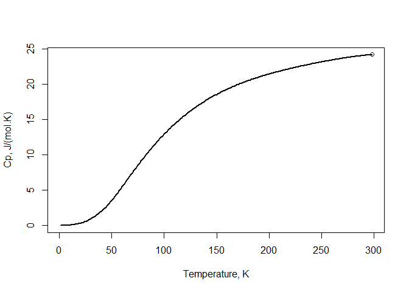
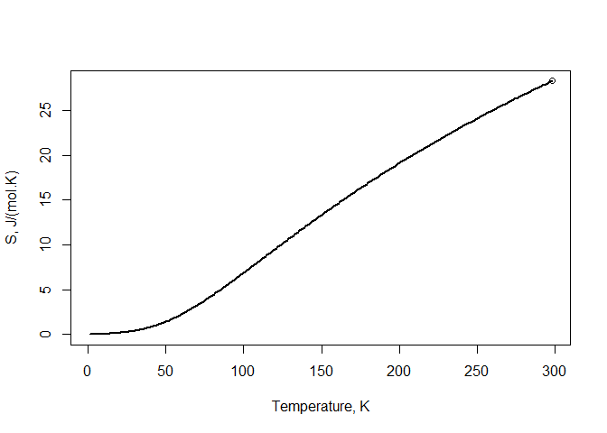
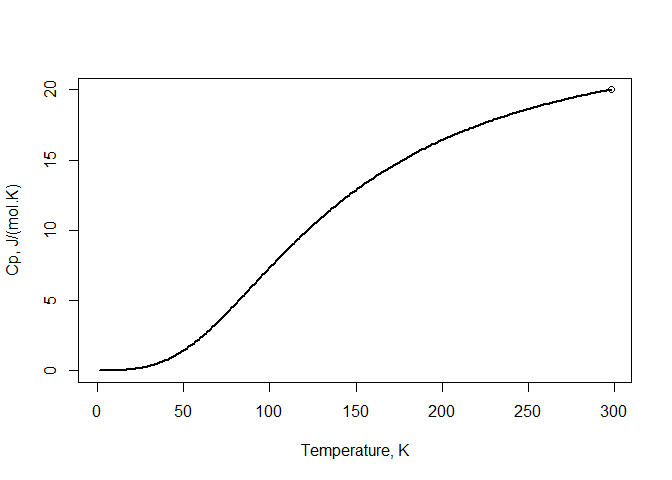

<!-- README.md is generated from README.Rmd. Please edit that file -->

# Calphad2.5

<!-- badges: start -->

[](https://travis-ci.com/AObaied/Calphad2.5)
<!-- badges: end -->

The 2 1/2th Calphad model is capable of extrapolating the Heat capacity
(Cp) and Entropy (S) descriptions from the room temperature down to 0 K
very accurately, using only two input parameters: The heat capacity and
Entropy values at room temperature (Cp298, S298).

## Installation

You can install the released version of Calphad2.5 from
[CRAN](https://CRAN.R-project.org) with:

``` r
install.packages("Calphad2.5")
```

## Example - Pure Si

Temp dependent solution:

``` r
library(Calphad2.5)

Calculate("Si", CP298 = 20, S298 = 18.82)
#> , , Model output:
#> 
#>           Input value Model Result
#> CP_298.15       20.00     20.00000
#> S_298.15        18.82     18.82345
#> 
#> , , Model parameters:
#> 
#>                                                    
#> Debye_Temp.                             641.7186284
#> a1_parameter_(Temp._Dependent_solution) 531.2500000
#> b1_parameter_(Temp._Dependent_solution)   0.3705136
#> b'_parameter_(Linear_Cp_solution)         0.0000000
#> Number of atoms                           1.0000000
#> 
#> , , polynomial_function_parameters:
#> 
#>                 
#> a1  0.000000e+00
#> b1  7.299323e-07
#> c1 -9.121419e-07
#> d1  1.318048e-05
#> e1 -4.587642e-08
#> f1  7.098287e-10
#> g1 -8.553738e-12
#> a2 -5.382537e+01
#> b2  6.848982e-01
#> c2 -2.930307e-03
#> d2  6.316738e-06
#> e2 -5.477840e-09
#> f2  1.863324e+03
#> g2 -2.414895e+04
```

## Example - Pure Al

Temp dependent solution:

``` r
library(Calphad2.5)

Calculate("Al",  CP298 = 24.209, S298 = 28.275)
#> , , Model output:
#> 
#>           Input value Model Result
#> CP_298.15      24.209     24.21027
#> S_298.15       28.275     28.29019
#> 
#> , , Model parameters:
#> 
#>                                                     
#> Debye_Temp.                             4.021000e+02
#> a1_parameter_(Temp._Dependent_solution) 0.000000e+00
#> b1_parameter_(Temp._Dependent_solution) 0.000000e+00
#> b'_parameter_(Linear_Cp_solution)       4.681564e-03
#> Number of atoms                         1.000000e+00
#> 
#> , , polynomial_function_parameters:
#> 
#>                 
#> a1  0.000000e+00
#> b1  6.103385e-06
#> c1 -8.659786e-06
#> d1  3.220496e-05
#> e1 -2.250219e-07
#> f1  9.176988e-09
#> g1 -1.337226e-10
#> a2 -3.011278e+01
#> b2  6.633422e-01
#> c2 -3.571942e-03
#> d2  9.258603e-06
#> e2 -9.346278e-09
#> f2  3.278018e+02
#> g2  3.830358e+03
```

## Example - Pure Al - Calulate and Plot Heat capacity and Entropy

Temp dependent solution:

``` r
library(Calphad2.5)

# Calculate Heat capacity (Cp)
Temp <- seq(1,298.15,1)
Cp <- calculate_Cp(Temp = Temp, compound = "Al",  CP298 = 24.209, S298 = 28.275)

# Plot Heat capacity (Cp)
plot(Temp,Cp,type="line", lwd=2, xlab = "Temperature, K", ylab = "Cp, J/(mol.K)")
points(298.15, 24.209)
```



``` r
# Calculate Entropy (S)
S <- calculate_S(Temp = Temp, compound = "Al",  CP298 = 24.209, S298 = 28.275)

# Plot Entropy (S)
plot(Temp,S,type="line", lwd=2, xlab = "Temperature, K", ylab = "S, J/(mol.K)")
points(298.15, 28.275)
```



## Example - Pure Si - Calulate and Plot Heat capacity and Entropy

Temp dependent solution:

``` r
library(Calphad2.5)

# Calculate Heat capacity (Cp)
Temp <- seq(1,298.15,1)
Cp <- calculate_Cp(Temp = Temp, compound = "Si", CP298 = 20, S298 = 18.82)

# Plot Heat capacity (Cp)
plot(Temp,Cp,type="line", lwd=2, xlab = "Temperature, K", ylab = "Cp, J/(mol.K)")
points(298.15, 20)
```



``` r
# Calculate Entropy (S)
S <- calculate_S(Temp = Temp, compound = "Si", CP298 = 20, S298 = 18.82)

# Plot Entropy (S)
plot(Temp,S,type="line", lwd=2, xlab = "Temperature, K", ylab = "S, J/(mol.K)")
points(298.15, 18.82)
```


